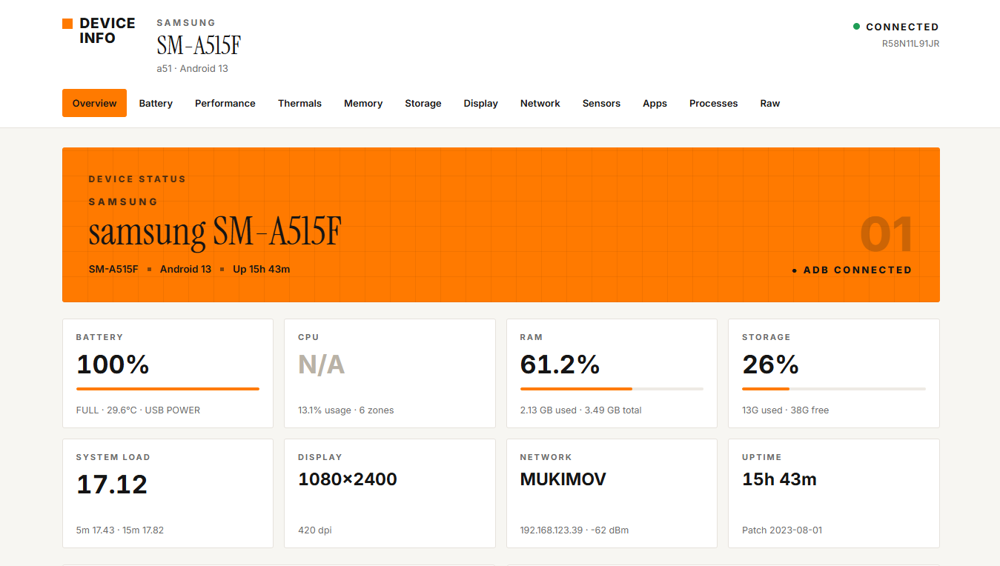
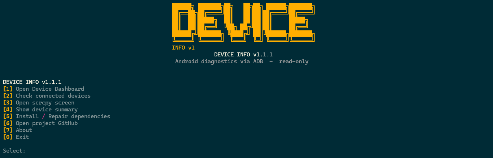

# DEVICE INFO

Android diagnostics, monitoring and device dashboard powered by ADB.


A modern Android device diagnostics dashboard powered by ADB.



## Screenshots

### CLI

Device Info provides an interactive terminal interface for managing connected Android devices.



### Web Dashboard

The local web dashboard provides a clean real-time overview of the connected Android device.


## Features

- Android device detection via ADB
- Live battery monitoring
- CPU and thermal information
- RAM monitoring
- Storage usage
- Display information
- Network status
- Sensors
- Installed applications
- Processes
- Raw ADB diagnostics
- Live charts
- scrcpy integration
- Automatic dependency checking
- Local Web Dashboard
- Read-only diagnostics

## Requirements

- Windows 10 / 11
- Python 3.10+
- Android phone with USB debugging enabled
- Internet (only on first run, to auto-install missing deps)

Python libraries are listed in `requirements.txt` (pinned versions) and
installed automatically on first start. If the machine is offline, the
program exits with a clear message instead of crashing later.

## Installation

```powershell
git clone https://github.com/muk1m0v/device_info.git
cd device_info
python main.py
```

Or with the `py` launcher:

```powershell
py main.py
```

On first start the program installs missing Python dependencies itself
(`python -m pip install -r requirements.txt`) and restarts.

## Quick start

1. Enable USB debugging on the phone.
2. Connect it via USB.
3. Run `python main.py`.
4. Accept the RSA fingerprint on the phone if asked.
5. Use the menu.

## CLI menu

```
DEVICE INFO v1.1.1

[1] Open Device Dashboard
[2] Check connected devices
[3] Open scrcpy screen
[4] Show device summary
[5] Install / Repair dependencies
[6] Open project GitHub
[7] About
[0] Exit

Select:
```

- **[1]** finds a free port, starts the backend on `127.0.0.1` (localhost
  only), opens the browser automatically, shows the URL. `Ctrl+C` stops the
  server cleanly. With several phones attached, pick one first.
- **[2]** shows `ADB STATUS` (installed / connected / serial / model / Android /
  authorized, `No Android device detected.`, `offline` hints, or
  `Device found but not authorized. Unlock the phone and accept USB debugging.`).
- **[3]** runs `scrcpy` (with `--serial` when several devices are attached);
  if missing, offers automatic install.
- **[4]** prints a short summary (device, Android, battery, temp, RAM, storage,
  resolution, ADB state) right in the terminal.
- **[5]** re-checks and repairs dependencies.
- **[6]** opens `https://github.com/muk1m0v/device_info` in the browser.
- **[7]** about screen.

## Web dashboard

Local Flask dashboard (default `http://127.0.0.1:5000+`, first free port,
**localhost only — never exposed to the network**, no debug mode):

- device card, battery, RAM, storage, resolution
- device dropdown when several phones are attached
- `/api/info` JSON endpoint for raw ADB diagnostics (`?serial=` supported)
- auto-refresh every 5 seconds (static data cached 120 s server-side)

## ADB info

Detection order:

1. `shutil.which("adb")` (system PATH),
2. `tools/platform-tools/adb.exe` (local auto-install).

If nothing is found:

```
Android Platform Tools not found.

[1] Install automatically
[2] Open download page
[0] Back
```

Auto-install downloads only from the official Google URL
(`dl.google.com`, HTTPS), unpacks to `tools/platform-tools/`, needs no admin
rights and does not touch system PATH. Archives are validated (size, ZIP
integrity, Zip-Slip member check). Already-installed tools are never
re-downloaded.

With several devices attached, the menu asks which one to use and every ADB
call goes through `adb -s SERIAL`.

## scrcpy integration

Detection order:

1. `shutil.which("scrcpy")`,
2. `tools/scrcpy/scrcpy.exe`.

If missing:

```
scrcpy not found.

[1] Install automatically
[2] Open official download page
[0] Back
```

Auto-install uses only official Genymobile/scrcpy GitHub releases and
unpacks to `tools/scrcpy/`.

## Supported systems

| Component | Status |
|-----------|--------|
| Windows 10 / 11 | ✅ supported |
| Python 3.10+ | ✅ required |
| ADB Platform Tools | ✅ auto-install |
| scrcpy | ✅ auto-install |
| Linux / macOS | ⚠️ should work, paths use `adb`/`scrcpy` from PATH |

## Troubleshooting

| Problem | Fix |
|---------|-----|
| `No Android device detected.` | Check cable, enable USB debugging, run `adb devices` |
| `unauthorized` | Unlock phone, accept RSA dialog, re-plug |
| `offline` | Re-plug cable, run `adb kill-server` + `adb devices` |
| `adb not found` | Menu → [5], or [2] → [1] auto-install |
| `scrcpy not found` | Menu → [3] → [1] auto-install |
| pip install fails / offline | Error message tells the exact manual command; connect to the internet and retry |
| Port busy | App picks the next free port automatically |
| Blank dashboard | No authorized device — connect one first |
| Several phones | Menu shows a device picker; dashboard has a dropdown |

## Security

- Downloads only from `dl.google.com` / `developer.android.com`
  (ADB) and `github.com/Genymobile/scrcpy` (scrcpy), HTTPS only with a host
  allowlist.
- HTTP status, `Content-Length`, minimum size and ZIP integrity verified;
  every archive member is checked against Zip-Slip path traversal.
- No `shell=True`, no string-built commands — all subprocess calls use
  argument lists with timeouts.
- Dashboard listens on `127.0.0.1` only, no debug mode, no Werkzeug debugger.
- Failed downloads/installs never crash the app — a readable error is shown.
- Diagnostics are read-only by default (`getprop`, `dumpsys battery`,
  `/proc/meminfo`, `df`, `wm size`).
- Minimal rotating log (`logs/device-info.log`, git-ignored): lifecycle
  events only, serials truncated, no secrets.
- No passwords, tokens or private keys are stored. Device serials are
  detected at runtime via `adb devices`, never hardcoded.

## Project structure

```
device_info/
├── main.py
├── requirements.txt
├── README.md
├── LICENSE
├── .gitignore
├── app/
│   ├── __init__.py      # __version__ = "1.1.1"
│   ├── adb.py           # find_adb, devices, summary, temp normalization
│   ├── dashboard.py     # Flask app (localhost), free port, browser
│   └── logging_setup.py # rotating file log
├── cli/
│   ├── __init__.py
│   ├── banner.py        # ASCII DEVICE INFO v1
│   ├── menu.py          # options 1-7, 0 + device picker
│   └── installers.py    # platform-tools + scrcpy helpers (Zip-Slip safe)
├── docs/
│   └── screenshots/
│       └── dashboard.png
└── tools/
    ├── .gitkeep
    ├── platform-tools/  # auto-downloaded, git-ignored
    └── scrcpy/          # auto-downloaded, git-ignored
```

> Note: this checkout may additionally contain unrelated local
> Android/SystemUI reverse-engineering folders (`SystemUI-src/`, `build/` …).
> They are not part of Device Info v1 and do not affect `python main.py`.

## License

MIT — see [LICENSE](LICENSE). Author: MUKIMOV.

## Author

Created by **MUKIMOV** — Android diagnostics via ADB.
GitHub: [muk1m0v/device_info](https://github.com/muk1m0v/device_info)
